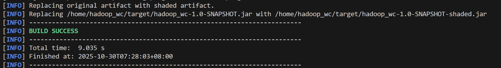
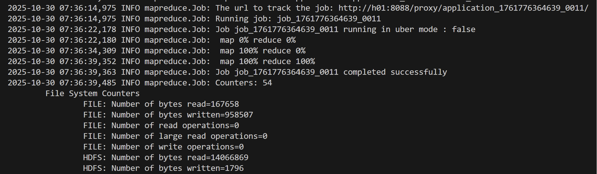
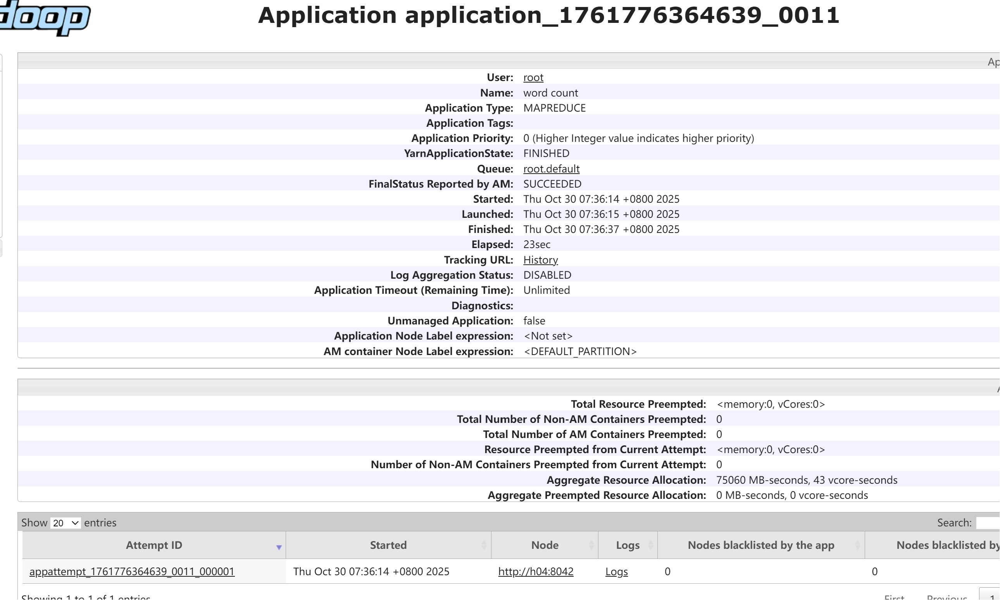
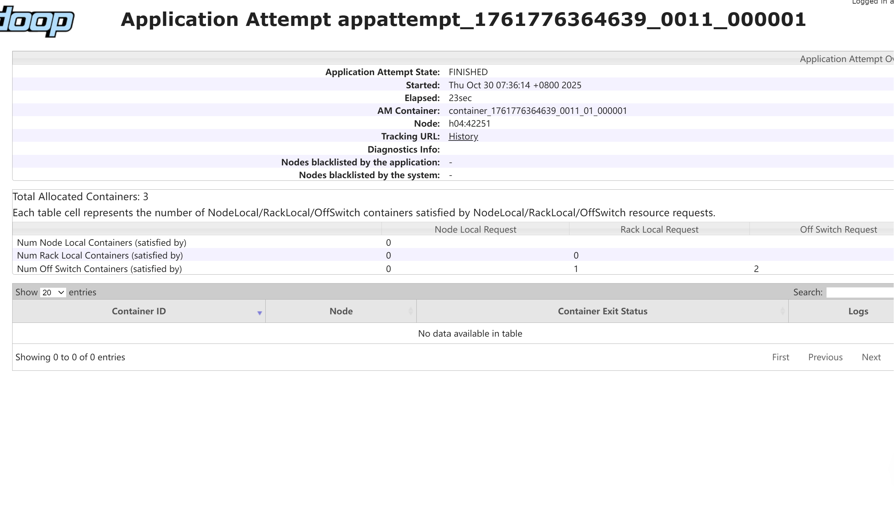
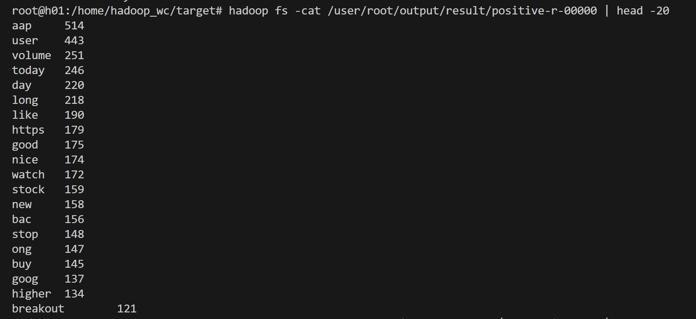
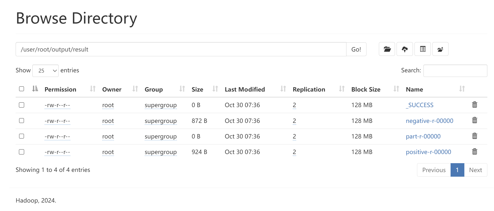

# Hadoop MapReduce 情感词频 Top-N 作业

本仓库包含金融大数据课程 HW05 的 MapReduce 实现与实验材料。

## 快速开始

1. 打包（已提供可运行 JAR 于 `target/`）：
	- Maven Shade 已配置，打包产物：`target/hadoop_wc-1.0-SNAPSHOT.jar`
2. 运行参数：`<input> <output> <stopwords>`（支持 HDFS 路径）
3. 输出：
	- `positive-r-00000`：正向情感 Top 词
	- `negative-r-00000`：负向情感 Top 词

更多细节、运行截图与性能分析见下。

## 目录

- `src/main/java/com/example/Main.java`：作业主类（Mapper/Combiner/Reducer/Driver）
- `target/*.jar`：打包产物
- `pom.xml`：依赖与 Shade 打包配置
- `result/`、`result-1/`：运行输出
- `pic/`：运行截图与结果报告
- `README.md`：介绍与实验报告


### 1. 实验目的

- 使用 Hadoop MapReduce 对股票新闻/推文语料进行分布式词频统计。
- 在同一作业中实现分词、去停用词、情感聚合，并输出正负情感各自的 Top-N 高频词。
- 熟悉 Hadoop 的 MultipleOutputs、DistributedCache（addCacheFile）等高级用法。

### 2. 数据与任务描述

- 输入数据格式：CSV，每行形如 `"sentence","label"`，其中 `label∈{1,-1}` 表示正/负情感。
- 作业目标：
  - 对句子进行清洗（小写化、去标点数字、归一空白）。
  - 过滤停用词（从分布式缓存加载）。
  - Key 设计为 `label_word`，通过 Combiner 在 Map 端局部聚合；Reduce 端统计全局词频，并按照情感分别取 Top 100 输出至独立文件。

### 3. 设计思路与实现

#### 3.1 关键架构

- Mapper：
  - 读取一行 CSV，解析为 `parts[0]=sentence`、`parts[1]=label`。
  - 预处理：去首尾引号、小写化、去非字母字符与数字、合并空白。
  - 使用 `StringTokenizer` 分词；按 `stopWords` 过滤，长度<2的token过滤。
  - 输出 `(Text(label + '_' + token), 1)`。
- Combiner：`IntSumReducer`，对相同 key 进行本地求和，减少 Shuffle 体积。
- Reducer（TopWordsReducer）：
  - 聚合后得到 `label_word -> count`。
  - 将正负样本分别存入 `TreeMap<Integer, List<String>>`（按频次倒序，频内字母序）。
  - 在 `cleanup` 阶段用 `MultipleOutputs` 分别输出 `positive-r-00000` 与 `negative-r-00000`，各 Top 100。
- 驱动：
  - 通过 `Job` 配置 Mapper/Combiner/Reducer、输入输出路径、`addCacheFile`(停用词)，`setNumReduceTasks(1)` 保证全局排序统一处理；
  - 如输出目录已存在则删除，方便多次运行。

#### 3.2 关键代码位置

- 代码位置：`src/main/java/com/example/Main.java`
- 依赖：`pom.xml`（Hadoop 3.4.0；shade 打包 fat-jar）
- 产物：`target/hadoop_wc-1.0-SNAPSHOT.jar`

#### 3.3 重要实现细节

- CSV 简易解析：支持引号内逗号；逐字符扫描，`inQuotes` 状态机处理。
- 文本预处理：
  - 正则 `[^a-zA-Z'\s]` 去非字母/空白；`\d+` 去数字；`\s+` 归一空白。
  - 去除首尾引号，统一小写。
- 停用词加载：
  - 通过 `context.getCacheFiles()` 获取分布式缓存文件；使用 Hadoop FS API 读取。
- Top-N 输出：
  - 使用 `TreeMap<Integer, List<String>>` 倒序保存频次，字母序稳定同频次。
  - `MultipleOutputs.addNamedOutput(job, ...)` 注册 `positive`、`negative` 两个命名输出。

### 4. 程序运行环境与步骤

- 运行环境：
  - JDK 11
  - Hadoop 3.x（本项目依赖 3.4.0 API）
  - Maven 3.6+
- 打包：在仓库根目录执行 Maven 打包，生成可提交到 YARN 的可运行 JAR。
- 运行参数：`<input> <output> <stopwords>`
- 示例运行（YARN 客户端或本地）：
  - 在 HDFS 已准备好输入与停用词后，提交作业：
    - 输入：股票语料 CSV
    - 输出：结果目录（若存在会被自动删除）

> 注：命令行具体示例见课程环境；该项目在 `target/` 目录已包含可运行 JAR，可直接提交。

### 5. 运行结果与截图

运行结果如下面的图片所示。

图1：maven编译成功截图

图2：jar成功运行截图

图3：8090端口查看application

图4：app详情（容器分配）

图5：在命令行预览结果

图6：结果在文件系统中的位置

- 输出目录：`result/` 
- 结果文件：
  - `positive-r-00000`：正向情感 Top 词；样例前若干行：

    ```
    aap	514
    user	443
    volume	251
    today	246
    ...
    ```

  - `negative-r-00000`：负向情感 Top 词；样例前若干行：

    ```
    aap	410
    short	356
    https	227
    user	203
    ...
    ```

  - `part-r-00000`：主输出因采用 `MultipleOutputs` 将Top词分流，主文件为空属预期。

### 6. 正确性说明与小结

- 通过 `setNumReduceTasks(1)` 保证 Top 计算的全局一致性。
- 通过 Combiner 降低网络传输；通过停用词过滤与长度阈值减少噪声。
- `MultipleOutputs` 将不同情感的结果独立输出，便于后续分析与可视化。

### 7. 性能分析与扩展性讨论

#### 7.1 当前性能特征

- Map 端：
  - 轻量 CSV 解析 + 正则清洗；`StringTokenizer` 与 `HashSet` 停用词查询为 O(1)。
  - Combiner 有效降低 `(label_word,1)` 的重复传输。
- Reduce 端：
  - `TreeMap<Integer, List<String>>` 在 cleanup 汇总一次排序输出，避免每 key 写出；但整体需要保留全部 key 的聚合结果于内存中，可能在超大词表时导致内存压力。

#### 7.2 可能瓶颈

- Top-N 计算在 Reducer 内保存全部词频再裁剪，空间复杂度较高。
- 单个 Reducer（`setNumReduceTasks(1)`）成为瓶颈，无法横向扩展。
- CSV 解析为手写状态机，边界情况（例如转义双引号）可能需要更强鲁棒性。

#### 7.3 可行改进

1) 可扩展的 Top-N 方案：
- 在 Reducer 中维护两个大小为 N 的最小堆（min-heap），只保留 Top N，内存 O(N)。
- 若需多 Reducer：各 Reducer 输出局部 Top-N，后续用第二个作业进行全局归并（TotalOrderPartitioner 或者 Map-Only 合并）。

2) 并行化与扩展：
- 设置 `job.setNumReduceTasks(R)`，使用自定义 `Partitioner<Text,IntWritable>` 按情感分区，或先按 `label` 分两路，最后再归并 Top-N。

3) I/O 与解析优化：
- 使用 Hadoop `TextInputFormat` 已经较高效；可选择更快的分词与预处理（如 RE2J 或预编译 Pattern）。
- 使用专业 CSV 库（例如 Univocity-parsers/OpenCSV）增强鲁棒性（需打包到 jar）。

### 8. 异常/错误与处理

- 输出目录已存在：代码内已自动删除，避免 `FileAlreadyExistsException`。
- 停用词未提供：Mapper 会打印警告；建议在提交命令中始终提供并确保 HDFS 可读。
- `result-1`有缺陷处理结果：该文件包含了原本的结果，可见"t""s"这样的单个字符，不难得出其实是单词的否定/复数/所有格等等变化被拆分所致；考虑到作业需要统计单词，故直接忽略这样的形态变化，将真正单词拆分出来，相应的结果即为`result`。

### 9. 结论

本实验完成了在 Hadoop 平台上对带情感标签的文本进行词频统计，并输出正负情感 Top 词的任务。实现了停用词过滤、Combiner 优化、MultipleOutputs 分流等关键技术点。结果文件与 WEB 截图已在仓库 `result/` 与 `pic/` 中提供。进一步可通过多 Reducer + 二次合并、堆式 Top-N、鲁棒 CSV 解析等方式增强性能与扩展性。
